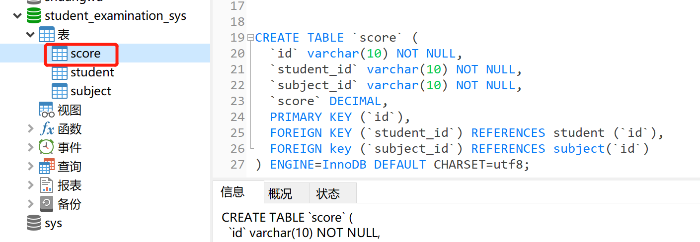
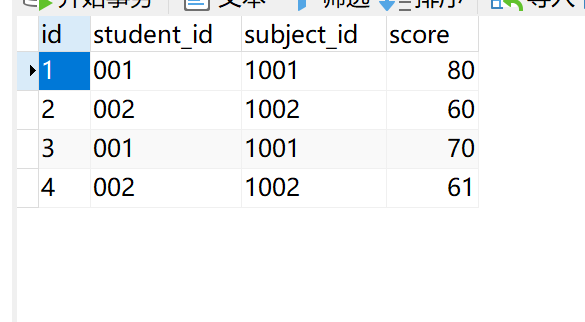

请在本地创建一个学生考试系统的数据库(student_examination_sys)，里面有三张表：

1. 学生表(student):

   |  id  | name | age  | sex  |
   | :--: | :--: | :--: | :--: |
   | 001  | 张三 |  18  |  男  |
   | 002  | 李四 |  20  |  女  |

2. 考试科目表(subject)：

   |  id  | subject | teacher |   description    |
   | :--: | :-----: | :-----: | :--------------: |
   | 1001 |  语文   | 王老师  | 本次考试比较简单 |
   | 1002 |  数学   | 刘老师  |  本次考试比较难  |

3. 成绩表(score)：

   |  id  | student_id | subject_id | score |
   | :--: | :--------: | :--------: | :---: |
   |  1   |    001     |    1001    |  80   |
   |  2   |    002     |    1002    |  60   |
   |  3   |    001     |    1001    |  70   |
   |  4   |    002     |    1002    | 60.5  |

请用SQL实现上面的需求并将实现的效果截图说明。

***

- 创建数据库


```
create database student_examination_sys;

```
- 创建学生表、科目表、成绩表
```
CREATE TABLE `student` (
  `id` varchar(10) NOT NULL,
  `name` varchar(20),
  `age` TINYINT,
 `sex` varchar(2),
  PRIMARY KEY (`id`)
) ENGINE=InnoDB DEFAULT CHARSET=utf8;


CREATE TABLE `subject` (
  `id` varchar(10) NOT NULL,
  `subject` varchar(20),
  `teacher` varchar(20),
  `description` varchar(100),
  PRIMARY KEY (`id`)
) ENGINE=InnoDB DEFAULT CHARSET=utf8;


CREATE TABLE `score` (
  `id` varchar(10) NOT NULL,
  `student_id` varchar(10) NOT NULL,
  `subject_id` varchar(10) NOT NULL,
  `score` DECIMAL,
  PRIMARY KEY (`id`),
 FOREIGN KEY (`student_id`) REFERENCES student (`id`),
 FOREIGN key (`subject_id`) REFERENCES subject(`id`)
) ENGINE=InnoDB DEFAULT CHARSET=utf8;

```



- 插入数据

```
INSERT INTO `student` VALUES ('001', '张三', 18, '男');
INSERT INTO `student` VALUES ('002', '李四', 20, '女');


INSERT INTO `subject`(`id`, `subject`, `teacher`, `description`) VALUES ('1001', '语文', '王老师', '本次考试比较简单');
INSERT INTO `subject`(`id`, `subject`, `teacher`, `description`) VALUES ('1002', '数学', '刘老师', '本次考试比较难');

INSERT INTO `score`(`id`, `student_id`, `subject_id`, `score`) VALUES ('1', '001', '1001', 80);
INSERT INTO `score`(`id`, `student_id`, `subject_id`, `score`) VALUES ('2', '002', '1002', 60);
INSERT INTO `score`(`id`, `student_id`, `subject_id`, `score`) VALUES ('3', '001', '1001', 70);
INSERT INTO `score`(`id`, `student_id`, `subject_id`, `score`) VALUES ('4', '002', '1002', 60.5);

```


